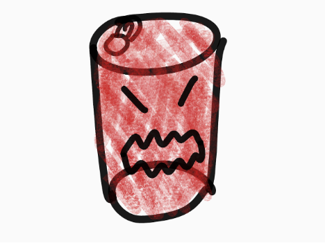
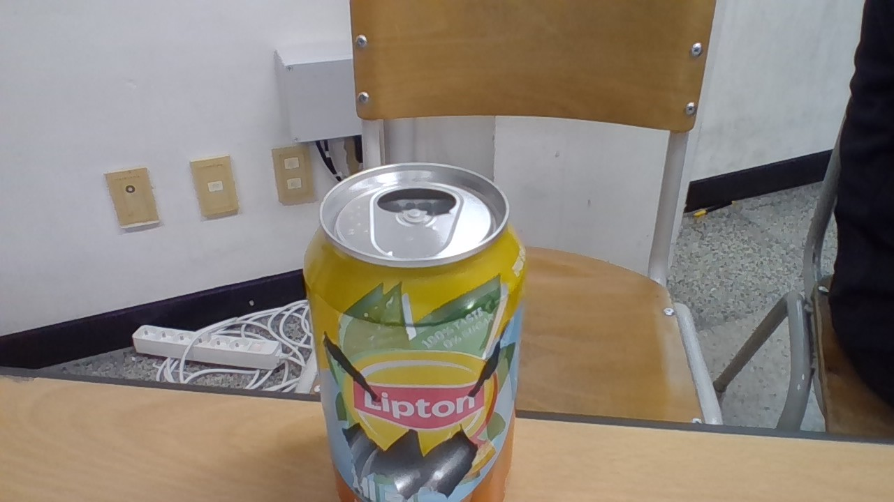

# 🌱 에코아트 프로젝트: [쓰레기 괴물]

## 📖 프로젝트 개요
- **제작자**: [오성윤]
- **제작일**: [7월15일]
- **소개**
우리에게는 평범한 캔이지만 물고기와 다른 동물들에게는 괴물같은 존재가 될수도 있다는걸 알리고싶었다

## 📦 사용 재료
- 캔,LED,
- 

## 🔧 제작 과정

### 1단계: 아이디어 스케치

- 빈 캔에 얼굴을 만든다
- 예상 완성도:90

### 2단계: 완성품

## 💭 제작 후기
### 잘된 점
- 내가 상상한 그대로 만든거같다

### 아쉬운 점
- 재료의 퀄리티가 부족하고 의미가 부족한거같다

### 개선할 점
- 재료를 좋은걸 쓰고 의미가 확실한것을 만들어야겠다

### 내가 이미 알고 있었던 것
- eco project라는것이 있는걸 알았다

### 새롭게 배운게 된 것
- 코딩을 전세계에 공유하는 사이트가 있는것을 처음 알았다

### 더 알고 싶은 것
- eco project처럼 이러한 예술이 더 있는지 궁금하다

## 🌍 환경적 의미
빈 캔이 우리에게는 평범한 캔이지만 다른 생물들에게는 치명적인 존재가 될수있다

## 📚 참고 자료
없음
## 🏷️ 태그
#에코아트 #재활용 #환경보호 #DIY #창의활동

> 이 프로젝트는 환경 보호와 창의적 사고를 위한 교육 목적으로 제작되었습니다.
